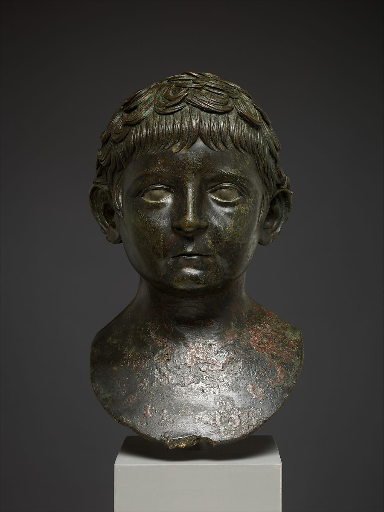
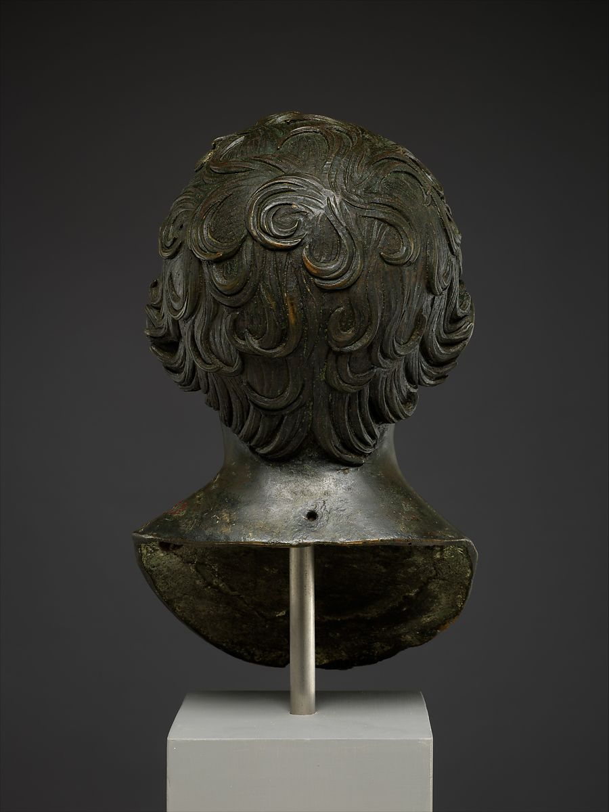
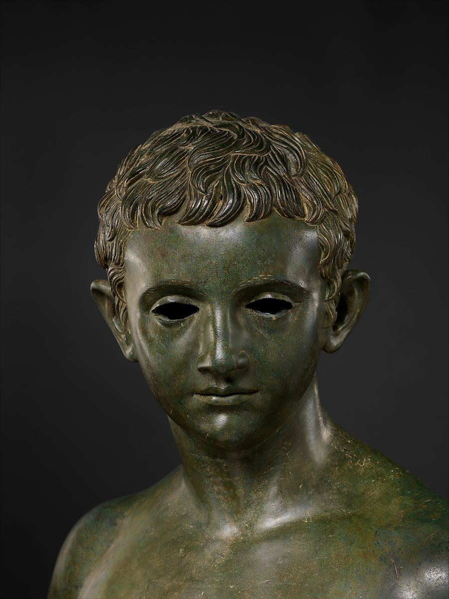
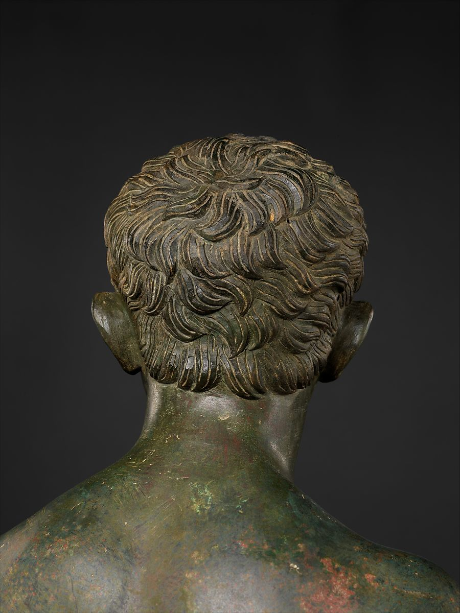

## Male Aristocratic Hairstyles

<i>Figure 1. Bronze portrait bust of a young boy (Left: Frontal view, Right: Back view). These images are taken from The Metropolitan Museum of Art (The Met). Clicking on the images above will take you to the page of this item, which includes more high-quality images of the item from different angles. These images are available through The Met under <a href="https://creativecommons.org/share-your-work/public-domain/cc0/">Creative Commons Zero (CC0)</a>.</i>

The boy in figure 1 has the Augustan-style hair with the clear part in his hair over the inner corner of his left eye and though the “crab-claw” motif is not as prominent. On the back of his head you can see the star-like shape, but the curls are thicker and in a higher relief than other emperor portraits discussed previously (see *[Emperor Hairstyles](../emperor-hairstyles.emperor-hairstyles.md)*). 

There was no inscription attached to this bust, however, many believe that it was the Roman emperor Nero in his youth. The hairstyle of this boy is similar to other portrait busts known to be of Nero, which is why many believe this one to be a younger version of him. By looking at the dates of this bust, the dates that Nero ruled, as well as the age of the boy, it seems unlikely that this was a portrait of Nero since he was thirteen when he was chosen to be Claudius’ successor as opposed to the boy represented in this portrait (see *[Nero](../emperor-hairstyles/nero.md)*). Nevertheless, this portrait is proof of the desire, by the public, to model themselves in the semblance of the royal family.<a id="fnref1" href="#fn1">1</a>

The very prominent hairstyle provides no room for misinterpretation; he is connecting himself directly with the royal family. This connection gives him an air of nobility and a slight connection to the royal family, even though there may be no familial connection. This is relatable to present-day traditions of a person copying a hairstyle of a celebrity.

<i>Figure 2. Bronze statue of an aristocratic boy (Left: Frontal view, Right: Back view). These images are taken from The Metropolitan Museum of Art (The Met). Clicking on the images above will take you to the page of this item, which includes more high-quality images of the item from different angles. These images are available through The Met under <a href="https://creativecommons.org/share-your-work/public-domain/cc0/">Creative Commons Zero (CC0)</a>.</i>

The boy in figure 2 resembles a prince of the Augustan royal family. Since this life-sized statue was found on the island of Rhodes, Greece, is thought that the statue is either of the son of a Roman official or the son of a wealthy Greek.<a id="fnref2" href="#fn2">2</a>

The comma-shaped locks and the "crab-claw" split of the hair on the forehead are very prominent, as is the star-shaped spiral of the locks of hair on the back of the head.

For both of these boys, the hair styles had to be very prominent because, even though they were not connected to the royal family line, they wanted to seem like they were.
  

---
1.  Paul Zanker, Roman Portraits: Sculptures in Stone and Bronze in The Collection of the Metropolitan Museum of Art (New Haven: Yale University Press, 2016), 113. <a href="#fnref1">↩</a>

2. <i>Bronze statue of an aristocratic boy.</i> 27 B.C.-A.D. 14. The Metropolitan Museum of Art, New York. <i>The Metropolitan Museu of Art</i>, https://www.metmuseum.org/art/collection/search/248891. <a href="#fnref2">↩</a>
---

← <a href="aristocratic-hairstyles.md.md">Back</a> &emsp; | &emsp; <a href="../readme.md">Table of Contents</a>

 
 

<a property="dct:title" rel="cc:attributionURL" href="https://github.com/arojas1/julio-claudian-hairstyles/blob/main/readme.md">Ancient Rome: Julio-Claudian Hairstyles An OER Exhibit Guide</a> by <a rel="cc:attributionURL dct:creator" property="cc:attributionName" href="https://github.com/arojas1">Ashley Rojas</a> is licensed under <a href="http://creativecommons.org/licenses/by/4.0/?ref=chooser-v1" target="_blank" rel="license noopener noreferrer" style="display:inline-block;">Attribution 4.0 International (CC BY 4.0) </a>
