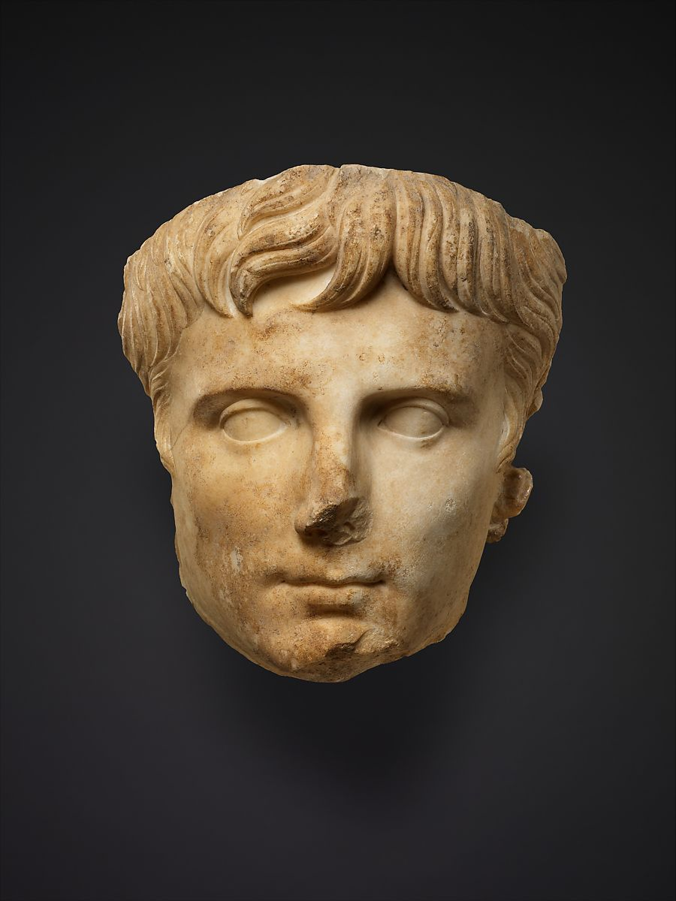
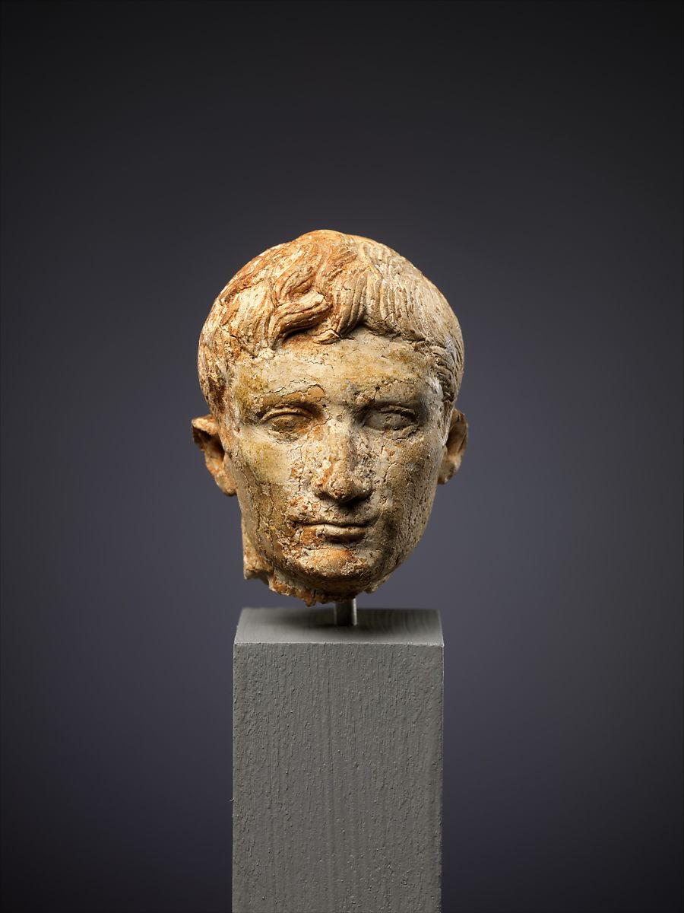
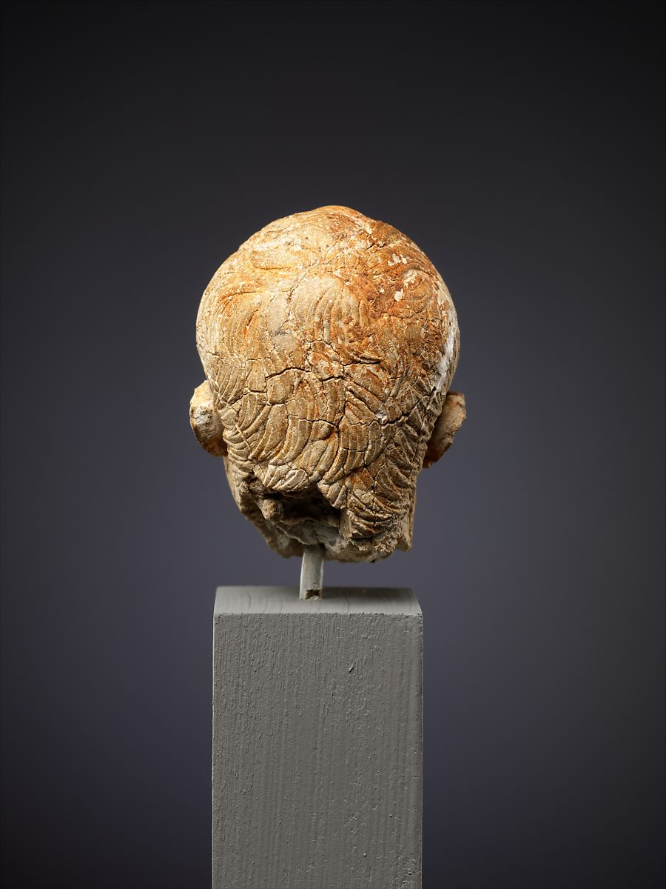
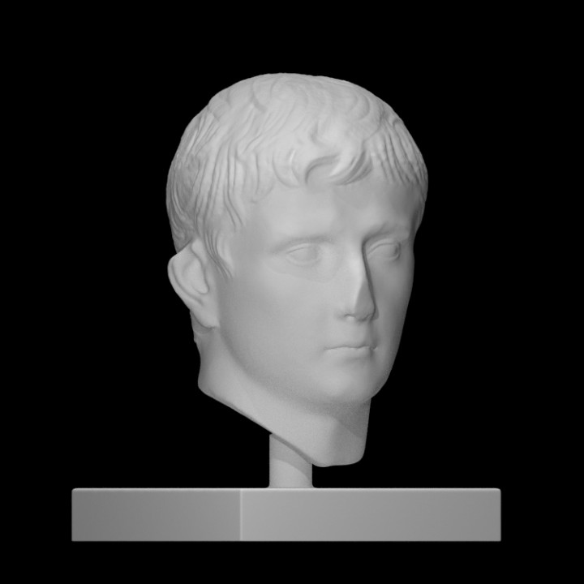
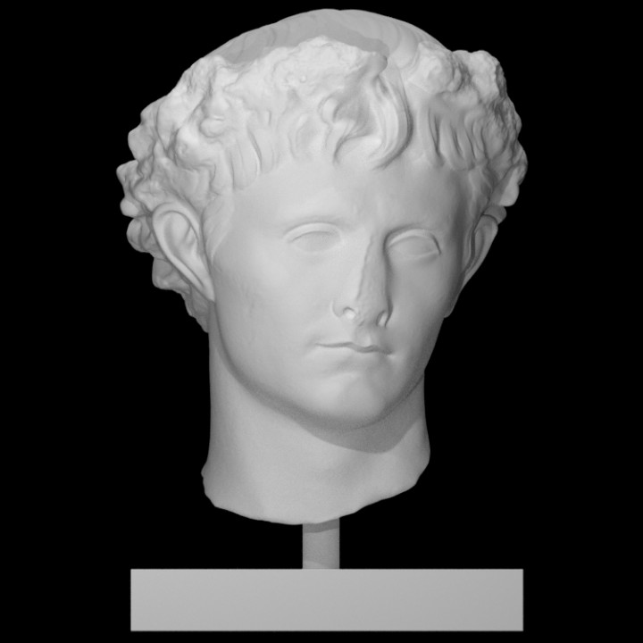

## Imperator Caesar Divi Filius Augustus (a.k.a Augustus)
 

### Background
Augustus was the first Roman emperor, taking over after his great-uncle and adoptive father, Julius Ceaser. He ruled from 27 B.C until his death in A.D 14.<a id="fnref1" href="#fn1">1</a> During his reign, Augustus nearly doubled the size of the empire as well as strengthened Roman infrastructure. After his death, he was declared to be a god by the Roman Senate.<a id="fnref2" href="#fn2">2</a>

Augustus, being the first Roman emperor, was the one to set the precedent for the Julio-Claudian portraitures and hairstyles. Moving on from the late Republic veristic (naturalistic) representations of portraits, where they represented all the flaws of a person (such as baldness, wrinkles, etc.) Augustus took inspiration from the Hellenistic Greek portraits and decided to represent himself in an idealized way.<a id="fnref3" href="#fn3">3</a> This is evident in the fact that none of the portraits throughout Augustus' reign portray him in old age (that have been found), despite him living until he was 77 years old.<a id="fnref4" href="#fn4">4</a>

  

### Portraiture

<i>Figure 1. Marble portrait of the emperor Augustus. This image is taken from The Metropolitan Museum of Art (The Met). Clicking on the image above will take you to the page of this item, which includes more high-quality images of the item from different angles. This image is available through The Met under a <a href="https://creativecommons.org/share-your-work/public-domain/cc0/">Creative Commons Zero (CC0)</a> license.</i>

The portrait in figure 1 very clearly has the "crab-claw" part, signifying the portrait is a part of the Julio-Claudian period. Although the portriat is broken in the back, we can assume that the portrait would have had the hair locks eminating in the signature star-like spiral. This portrait is over-lifesized. This scale is typically reserved for depictions of rulers or gods.
  

<i>Figure 2. Ivory portrait head of the emperor Augustus. These images are taken from The Metropolitan Museum of Art (The Met). Clicking on the images above will take you to the page of this item, which includes more high-quality images of the item from different angles. These images are available through The Met under a <a href="https://creativecommons.org/share-your-work/public-domain/cc0/">Creative Commons Zero (CC0)</a> license.</i>

Here is another example of a portrait of Augustus. Once again, the "crab-claw" is prominent in the front. Looking at the back, however, the star-like shape of the locks is prominent on this portrait. 
  

### Explore

Below are two portraits of Augustus that have been scanned and rendered as 3D models. These models are hosted on <a href="https://www.myminifactory.com/">MyMiniFactory</a> through the <a href="https://www.myminifactory.com/scantheworld/">Scan The World (STW)</a> initiative. Clicking on the images will take you to the page of this item, which includes more images of the item as well as a 3D rendering of the item that can be explored online or, in some cases, downloaded for printing on a 3D printer.
  

<i>Figure 3. Portrait of Emperor Augustus (MyMiniFactory: Scan The World). The 3D item is available for download from STW under a <a href="https://www.myminifactory.com/object-licensing">MyMiniFactory Exclusive-Credit-Remix-Noncommercial</a> license.</i>

This item is a scan of a portrait housed at the <a href="https://www.smb.museum/en/museums-institutions/bode-museum/home/">Bode Museum</a> in Berlin, Germany.
  

<i>Figure 4. Augustus with the Civic Crown (MyMiniFactory: Scan The World). The 3D item is available for download from STW under a <a href="https://creativecommons.org/licenses/by-nc-sa/4.0/">Creative Commons Attribution-NonCommercial-ShareAlike 4.0 International (CC BY-NC-SA 4.0)</a> license.</i>

This item is a scan of a portrait house at the <a href="https://www.antike-am-koenigsplatz.mwn.de/index.php/en/">Antike am Königsplatz</a> museum in Munich, Germany.
  

### Recent Discoveries

There was a recent discovery in Isernia, Italy of a marble head portrait of Augustus. Check out the article, which was published on May 5, 2021 in the Daily Mail: <a href="https://www.dailymail.co.uk/sciencetech/article-9546041/2-000-year-old-bust-Romes-emperor-Augustus-identified-telltale-hairstyle.html">Ancient marble head discovered under Italian town's 2,000-year-old city walls is identified as Rome's first emperor Augustus by his big ears and unusual 'swallow-tail' hairstyle</a>.
  

---
1. https://www.britannica.com/biography/Augustus-Roman-emperor <a href="#fnref1">↩</a>

2. https://www.history.com/topics/ancient-history/emperor-augustus <a href="#fnref2">↩</a>

3. https://www.metmuseum.org/art/metpublications/Roman_Art_A_Resource_for_Educators (pg. 39) <a href="#fnref3">↩</a>

4. https://www.metmuseum.org/art/collection/search/247993 <a href="#fnref4">↩</a>
---

← <a href="emperor-hairstyles.md">Back</a> &emsp; | &emsp; <a href="../readme.md">Table of Contents</a> &emsp; | &emsp; <a href="tiberius.md">Next</a> →

 
 

<a property="dct:title" rel="cc:attributionURL" href="https://github.com/arojas1/julio-claudian-hairstyles/blob/main/readme.md">Ancient Rome: Julio-Claudian Hairstyles An OER Exhibit Guide</a> by <a rel="cc:attributionURL dct:creator" property="cc:attributionName" href="https://github.com/arojas1">Ashley Rojas</a> is licensed under <a href="http://creativecommons.org/licenses/by/4.0/?ref=chooser-v1" target="_blank" rel="license noopener noreferrer" style="display:inline-block;">Attribution 4.0 International (CC BY 4.0) </a>
