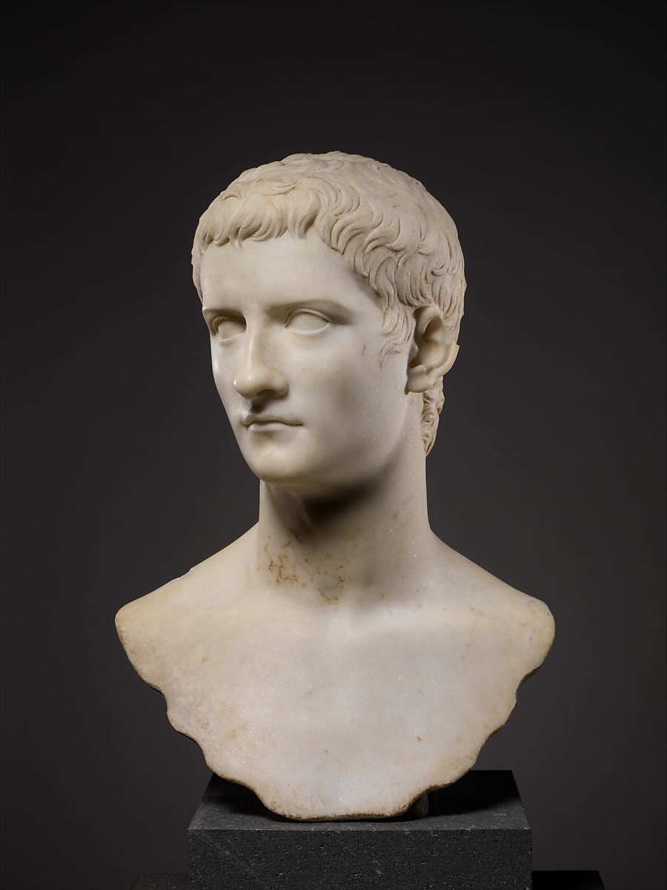

## Gaius Julius Caesar Augustus Germanicus (a.k.a Caligula)
 

### Background

Caligula, originally known as Gaius Caesar Germanicus, son of Germanicus Caesar and Agrippina the Elder, came into power in A.D 37 at the age of twenty-four. There are many ancient sources who talk about Caligula being “mad” or “insane.” This madness, possibly brought on by epilepsy, made him “an increasingly blood thirsty and vicious tyrant.”<a id="fnref1" href="#fn1">1</a> During his reign he declared himself a god, which may have been one of the many factors that led to his assassination.<a id="fnref2" href="#fn2">2</a> He also started to disassociate himself with his family line because he wanted to be perceived as the best amongst them all. He forbade people to connect him with his grandfather, Agrippa, because he was of “humble origin” and he even tried to ruin the image of Augustus by saying that he committed incest with his daughter, Julia, who then gave birth to Caligula’s mother, Agrippina the Elder.<a id="fnref3" href="#fn3">3</a>

Caligula was not popular amongst the people. This was evident when, after he was assassinated in A.D. 41, he was “subjected to *damnatio memoriae*-effectively eradicated from memory.”<a id="fnref4" href="#fn4">4</a> Thus, many portraits of Caligula were altered in order to represent either Divus Augustus or Claudius.<a id="fnref5" href="#fn5">5</a>
  

### Portraiture
 

<i>Figure 1. Marble portrait bust of Caligula (Left: Frontal view, Right: Back view). These images are taken from The Metropolitan Museum of Art (The Met). Clicking on the images above will take you to the page of this item, which includes more high-quality images of the item from different angles. These images are available through The Met under <a href="https://creativecommons.org/share-your-work/public-domain/cc0/">Creative Commons Zero (CC0)</a>.</i>

Looking at this portrait bust, the first characteristic that can connect this bust to the Julio-Claudian time period (without knowing the person depicted) is the iconic Augustan-style hair. There is a slight part in his hair over his left eye as well as the “crab-claw” motif over his nose (as opposed to the right eye for Augustus). Looking at the back of his head, you can see the waves of his hair which originate from one point on his head and span out in a light, star-like shape.

<i>Fig. 1</i>

  

---
1. BarryJones, “C,” Dictionary of World Biography, 135-214, (ANU Press, 2016), http://www.jstor.org/stable/j.ctt1bw1h8n.7. <a href="#fnref1">↩</a>

2. Barbara Sidwell, “Gaius Caligula’s Mental Illness,” The Classical World 103, no. 2 (2010): 183-206, http://www.jstor.org/stable/40599927. <a href="#fnref2">↩</a>

3. Suetonius, Lives of the Caesars: Volume II (Massachusetts: Harvard University Press,1914), http://penelope.uchicago.edu/Thayer/E/Roman/Texts/Suetonius/12Caesars/Caligula*.html#1. <a href="#fnref3">↩</a>

4. Paul Zanker, Roman Portraits: Sculptures in Stone and Bronze in The Collection of the Metropolitan Museum of Art (New Haven: Yale University Press, 2016), 58. <a href="#fnref4">↩</a>

5. Paul Zanker, Roman Portraits: Sculptures in Stone and Bronze in The Collection of the Metropolitan Museum of Art (New Haven: Yale University Press, 2016), 58. <a href="#fnref5">↩</a>
---

← <a href="tiberius.md">Back</a> &emsp; | &emsp; <a href="readme.md">Table of Contents</a> &emsp; | &emsp; <a href="claudius.md">Next</a> →

