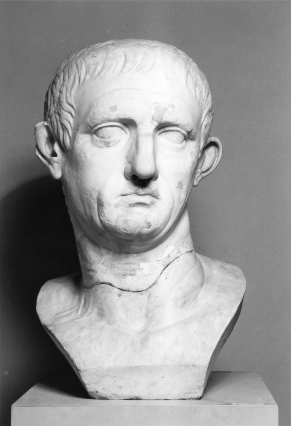
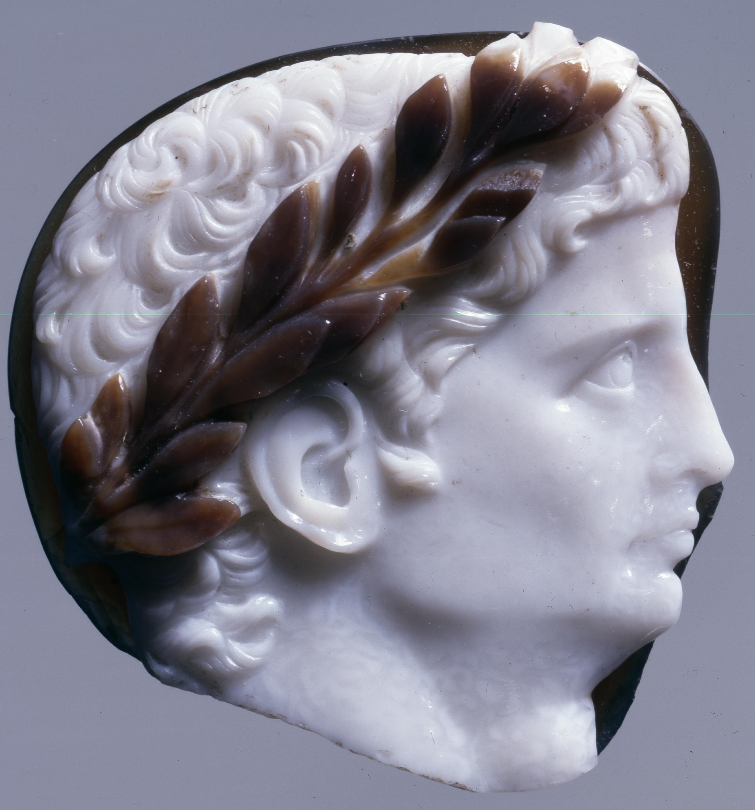
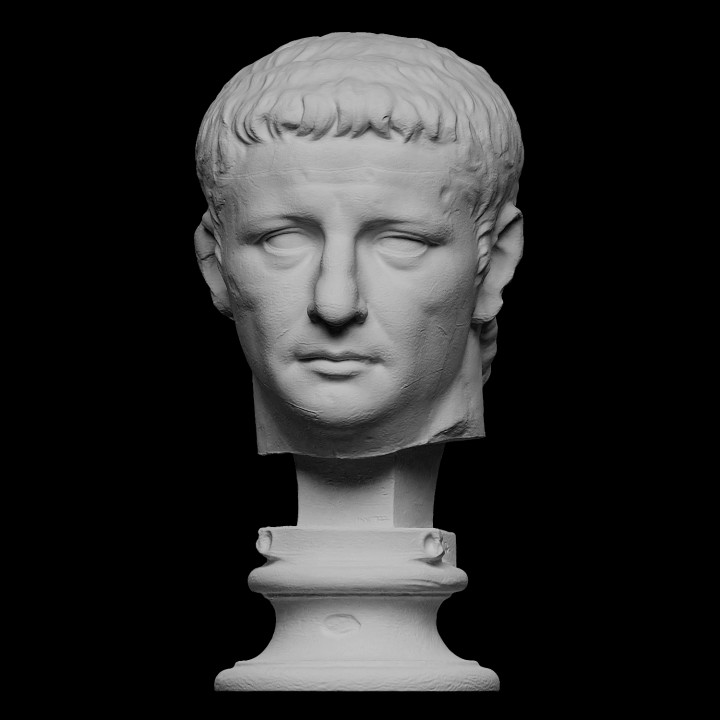

## Tiberius Claudius Caesar Augustus Germanicus (a.k.a Claudius)
 

### Background
Claudius (r. 41-54 A.D.) rose to power after Caligula as the last adult male of his family.<a id="fnref1" href="#fn1">1</a> Claudius suffered from illness and was left disfigured when he was young. Before rising to power, he was considered the family "fool". Due to this, he was not favored amongst the Senate (especially with the reputation of Caligula before him). He, however, was also popular due to his endering behavior towards others.
  

### Portraiture
 

<i>Figure 1. Portrait of Emperor Nero, Re-Carved as Claudius. This image is taken from The Walters Art Museum. Clicking on the image above will take you to the page of this item. This image is available through The Walters Art Museum under a <a href="https://creativecommons.org/share-your-work/public-domain/cc0/">Creative Commons Zero (CC0)</a> license.</i>

This portrait in figure 1 is one example of a portrait being changed after the death of an emperor. Typically held for emperors that have been subject to *damnatio memoriae* after their death. This portrait was originally a portrait of Nero who, like Caligula, was disliked and subjected to *damnatio memoriae* after his death (see *[Nero](nero.md)*).

Claudius was an older man when he came to power. Even though it was traditional during this time period to portray one's self as a young man, the purpose of this portrait was most likely more focused on removing the representation of Nero and trying to focus on the portrait representing Claudius.

Whether representing Nero or Claudius, the hair style is the same. The V-shaped split of the hair as well as the comma-shaped locks are prominent in the portrait in figure 1.
  

<i>Figure 2. Fragment of a large sardonyx cameo: head of the emperor Claudius wearing a laurel wreath. This image is taken from The British Museum. Clicking on the image above will take you to the page of this item. This image is available through The British Museum under a <a href="http://creativecommons.org/licenses/by-nc-sa/4.0/">Creative Commons Attribution-NonCommercial-ShareAlike 4.0 International (CC BY-NC-SA 4.0)</a> license.</i>

Cameo, is a method of carving gems, jewelry or a vessel. Cameo was very popular during the Julio-Claudian period. In this cameo, Claudius is depicted with a laurel wreath. Although it is a side portrait, the comma-shaped locks can be seen very clearly as well as the star-like shape of the hair on the back of the head.
  

### Explore
Below is a portrait of Claudius that has been scanned and rendered as a 3D model. This model is hosted on <a href="https://www.myminifactory.com/">MyMiniFactory</a> through the <a href="https://www.myminifactory.com/scantheworld/">Scan The World (STW)</a> initiative. Clicking on the image will take you to the page of this item, which includes more images of the item as well as a 3D rendering of the item that can be explored online or, in some cases, downloaded for printing on a 3D printer.
  

<i>Figure 3. Portrait of Claudius (MyMiniFactory: Scan The World). The 3D item is available for download from STW under a <a href="https://creativecommons.org/publicdomain/zero/1.0">Creative Commmons Zero (CC0)</a> license.</i>

This item is a scan of a portrait housed at the <a href="https://collection.smk.dk/#/en/">Statens Museum for Kunst (SMK)</a> in Copenhagen, Denmark.
  

---
1. https://en.wikipedia.org/wiki/Claudius <a href="#fnref1">↩</a>

2. https://www.pbs.org/empires/romans/empire/claudius.html <a href="#fnref2">↩</a>

3. https://en.wikipedia.org/wiki/Cameo_(carving) <a href="#fnref3">↩</a>
---

← <a href="caligula.md">Back</a> &emsp; | &emsp; <a href="../readme.md">Table of Contents</a> &emsp; | &emsp; <a href="nero.md">Next</a> →

 
 

<a property="dct:title" rel="cc:attributionURL" href="https://github.com/arojas1/julio-claudian-hairstyles/blob/main/readme.md">Ancient Rome: Julio-Claudian Hairstyles An OER Exhibit Guide</a> by <a rel="cc:attributionURL dct:creator" property="cc:attributionName" href="https://github.com/arojas1">Ashley Rojas</a> is licensed under <a href="http://creativecommons.org/licenses/by/4.0/?ref=chooser-v1" target="_blank" rel="license noopener noreferrer" style="display:inline-block;">Attribution 4.0 International (CC BY 4.0) </a>
