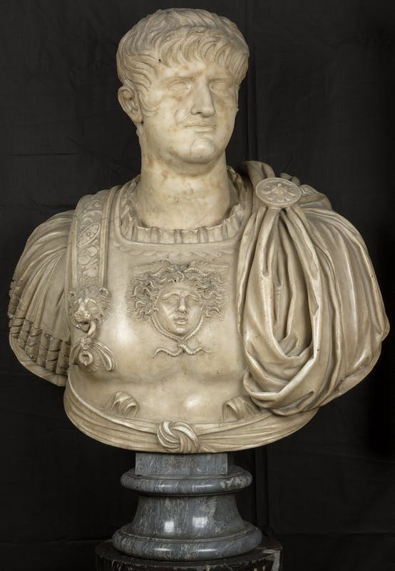
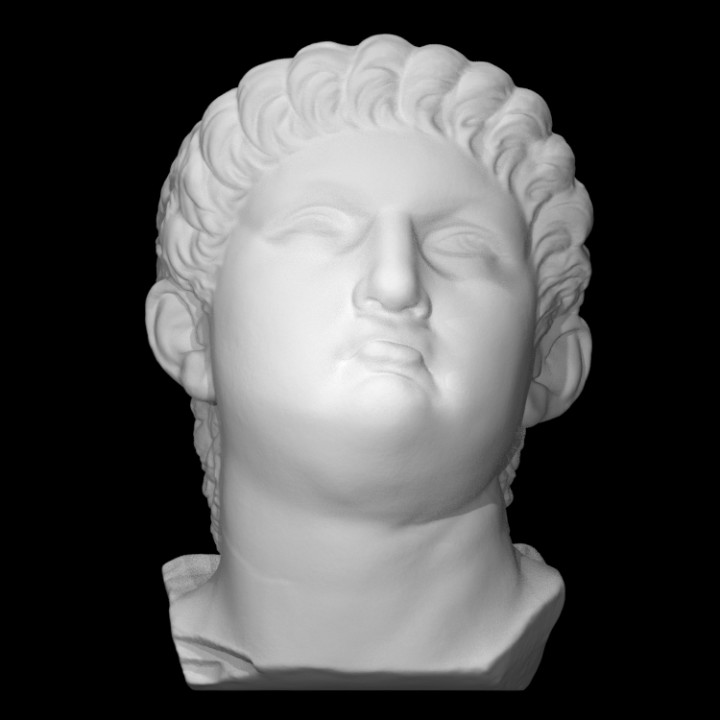

## Nero Claudius Caesar Augustus Germanicus (a.k.a Nero)
 

### Background

Nero, who reigned from A.D. 54-68, was adopted at the age of thirteen by the emperor at that time, Claudius (reign from A.D. 41-54), and rose to power at the age of seventeen.<a id="fnref1" href="#fn1">1</a>

Similar to Caligula, Nero was not very popular amongst the people. He was declared a public enemy and, before he was captured and punished to death, he killed himself, being one of the first emperors to commit suicide.<a id="fnref2" href="#fn2">2</a> After his death he was condemned to *damnatio memoriae*.<a id="fnref3" href="#fn3">3</a> The portraits of Nero were altered to represent the emperor Vespasian, his sons, or Divus Augustus.<a id="fnref4" href="#fn4">4</a>
  

### Portraiture
 

<i>Figure 1. Portrait of Nero. This image is taken from Le Gallerie Degli Uffizi. Clicking on the image above will take you to the page of this item. This image is available through Le Gallerie Degli Uffizi for personal, education and informational purposes only. Please visit their <a href="https://www.uffizi.it/en/professional-services/wewef">Rights & Reproductions</a> page for more information.</i>

Nero was the first to try to take the Augustan hair style and make it his own. Breaking from tradition, Nero's portraits wore his hair long in the front, but also kept the comma-shaped hair locks. Another characteristic for Nero was having long side burns. In some portraits of Caligula, he had slight side burns as well. By breaking from tradition and having a feature similar to Caligula did not help with Nero's public image.<a id="fnref5" href="#fn5">5</a>
  

### Explore
Below is a portrait of Nero that has been scanned and rendered as a 3D model. This model is hosted on <a href="https://www.myminifactory.com/">MyMiniFactory</a> through the <a href="https://www.myminifactory.com/scantheworld/">Scan The World (STW)</a> initiative. Clicking on the image will take you to the page of this item, which includes more images of the item as well as a 3D rendering of the item that can be explored online or, in some cases, downloaded for printing on a 3D printer.
  

<i>Figure 3. Portrait of Nero (MyMiniFactory: Scan The World). The 3D item is available for download from STW under a <a href="https://www.myminifactory.com/object-licensing">MyMiniFactory Exclusive-Credit-Remix-NonCommercial</a> license.</i>

This item is a scan of a portrait housed at the <a href="https://www.ed.ac.uk/visit/museums-galleries/anatomical">Anatomical Museum</a> in Edinburgh, Scotland.
  

---
1.  Paul Zanker, Roman Portraits: Sculptures in Stone and Bronze in The Collection of the Metropolitan Museum of Art (New Haven: Yale University Press, 2016), 113. <a href="#fnref1">↩</a>

2. Suetonius, Lives of the Caesars: Volume VI (Massachusetts: Harvard University Press, 1914), https://www-loebclassics-com.proxy.wexler.hunter.cuny.edu/view/suetonius-lives_caesars_book_vi_nero/1914/pb_LCL038.171.xml. <a href="#fnref2">↩</a>

3.  Paul Zanker, Roman Portraits: Sculptures in Stone and Bronze in The Collection of the Metropolitan Museum of Art (New Haven: Yale University Press, 2016), 59. <a href="#fnref3">↩</a>

4.  Paul Zanker, Roman Portraits: Sculptures in Stone and Bronze in The Collection of the Metropolitan Museum of Art (New Haven: Yale University Press, 2016), 59. <a href="#fnref4">↩</a>

5. https://www.donottouchblog.com/home/rise-and-fall-of-hair <a href="#fnref5">↩</a>
---

← <a href="claudius.md">Back</a> &emsp; | &emsp; <a href="../readme.md">Table of Contents</a> &emsp; | &emsp; <a href="../aristocratic-hairstyles/aristocratic-hairstyles.md">Next</a> →

 
 

<a property="dct:title" rel="cc:attributionURL" href="https://github.com/arojas1/julio-claudian-hairstyles/blob/main/readme.md">Ancient Rome: Julio-Claudian Hairstyles An OER Exhibit Guide</a> by <a rel="cc:attributionURL dct:creator" property="cc:attributionName" href="https://github.com/arojas1">Ashley Rojas</a> is licensed under <a href="http://creativecommons.org/licenses/by/4.0/?ref=chooser-v1" target="_blank" rel="license noopener noreferrer" style="display:inline-block;">Attribution 4.0 International (CC BY 4.0) </a>
