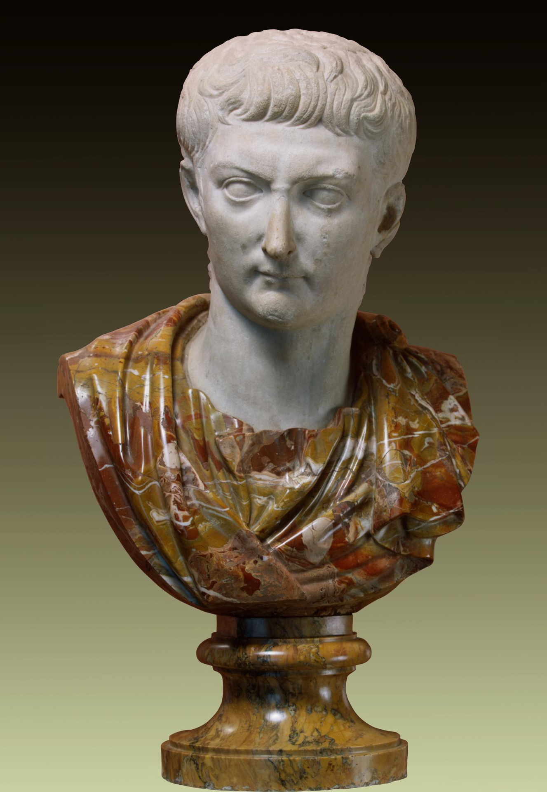
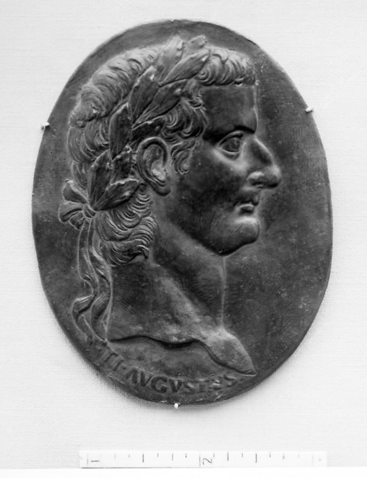
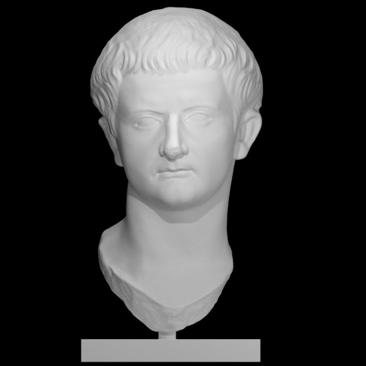

## Tiberius Caesar Divi Augusti Filius Augustus (a.k.a Tiberius)
 

### Background
Tiberius (r. 14–37 A.D.), the stepson of Augustus, rose to power after the death of Augustus. This was after Augustus' other previously chosen successors died before himself.<a id="fnref1" href="#fn1">1</a> Although Tiberius was not actually related to Augustus, his portraits portray a remarkable, and fictionalized, resemblance that connected him to Augustus and helped substantiate his position as successor.<a id="fnref2" href="#fn2">2</a>
  

### Portraiture
 

<i>Figure 1. Portrait of Emperor Tiberius. This image is taken from The Hermitage Museum. Clicking on the image above will take you to the page of this item. This image is available through the Hermitage Museum for personal, education and informational purposes only. Please visit their <a href="https://www.hermitagemuseum.org/wps/portal/hermitage/about/image_usage_policy?lng=en">Image Usage Policy</a> page for more information.</i>

Although it is not as prominent in this bust as in the Augustus ones, Tiberius has the same "crab-claw" parting of his hair at the front. Another feature of the Augustan-style, that is more prominent in this bust as opposed to those of Agustus, is the comma-shaped hair locks along the forehead.
  

<i>Figure 2. Portrait of Emperor Tiberius. This image is taken from The Metropolitan Museum of Art (The Met). Clicking on the images above will take you to the page of this item, which includes more high-quality images of the item from different angles. These images are available through The Met under a <a href="https://creativecommons.org/share-your-work/public-domain/cc0/">Creative Commons Zero (CC0)</a> license.</i>

Portraits of the Emperors can appear in many forms such as busts, statues, coins, and, in the case of figure 2, plaques. This plaque although just a side portrait, still has to follow the hairstyles of the time to help identify the subject.

Although the "crab-claw" motif cannot be seen here, the comma-style of the hair locks is clearly visible. One hair feature that is unique to Tiberius is the long hair on the back of the neck. This was said to be a family trait by the Roman historian, Suetonius.<a id="fnref3" href="#fn3">3</a>
  

### Explore
Below is a portrait of Tiberius that has been scanned and rendered as a 3D model. This model is hosted on <a href="https://www.myminifactory.com/">MyMiniFactory</a> through the <a href="https://www.myminifactory.com/scantheworld/">Scan The World (STW)</a> initiative. Clicking on the image will take you to the page of this item, which includes more images of the item as well as a 3D rendering of the item that can be explored online or, in some cases, downloaded for printing on a 3D printer.
  

<i>Figure 3. Portrait of Tiberius (MyMiniFactory: Scan The World). The 3D item is available for download from STW under a <a href="https://www.myminifactory.com/object-licensing">MyMiniFactory Credit-Remix-Commercial</a> license.</i>

This item is a scan of a portrait housed at the <a href="https://saintraymond.toulouse.fr/">Musée Saint-Raymond</a> in Toulouse, France.
  

  

---
1. https://harvardartmuseums.org/art/311091 <a href="#fnref1">↩</a>

2. https://www.metmuseum.org/toah/hd/ropo2/hd_ropo2.htm <a href="#fnref2">↩</a>

3. https://www.hermitagemuseum.org/wps/portal/hermitage/digital-collection/06.+sculpture/793 <a href="#fnref3">↩</a>
---

← <a href="augustus.md">Back</a> &emsp; | &emsp; <a href="../readme.md">Table of Contents</a> &emsp; | &emsp; <a href="caligula.md">Next</a> →

 
 

<a property="dct:title" rel="cc:attributionURL" href="https://github.com/arojas1/julio-claudian-hairstyles/blob/main/readme.md">Ancient Rome: Julio-Claudian Hairstyles An OER Exhibit Guide</a> by <a rel="cc:attributionURL dct:creator" property="cc:attributionName" href="https://github.com/arojas1">Ashley Rojas</a> is licensed under <a href="http://creativecommons.org/licenses/by/4.0/?ref=chooser-v1" target="_blank" rel="license noopener noreferrer" style="display:inline-block;">Attribution 4.0 International (CC BY 4.0) </a>
