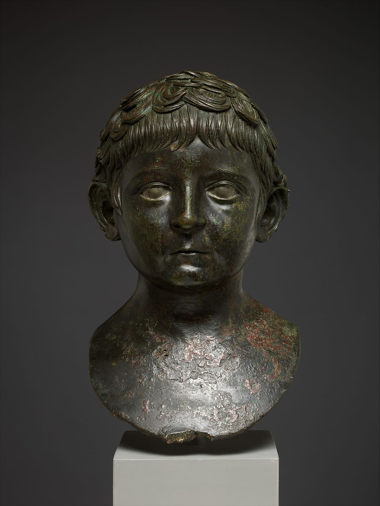

## Lucius Domitius Ahenobarbus (a.k.a Nero)

    <figure><figcaption><i>Fig. 2 Bronze portrait bust of a young boy (Left: Frontal view, Right: Back view). Early Imperial, Julio-Claudian, A.D. 50-68. Marble, H. 0.292m. The Metropolitan Museum of Art, New York. From: The Metropolitan Museum of Art, http://www.metmuseum.org (accessed May 6, 2021).</i></figcaption></figure>

Fig. 2 shows a bronze portrait bust of a young boy dated to around A.D. 50-68 from the Julio-Claudian period and the bust stands at 0.292 meters high representing a six to eight year old boy. 

This boy also has the Augustan-style hair with the clear part in his hair over the inner corner of his left eye and the “crab-claw” motif is not as prominent. On the back of his head you can see the star-like shape that was on the back of the portrait of Caligula (fig. 1), but the curls are thicker and in a higher relief than those on the head of Caligula. Like Caligula, the boy seems to have slightly larger ears and eyes than are proportionate for his head. His eyes are inlaid with silver for the white of the eyes. He has plump cheeks that is characteristic for children and has thin lips. The boy’s head is facing directly at the viewer and, according to The Metropolitan Museum of Art, the portrait bust would have been set upon a “herm of wood or stone”, a herm being a square pillar used in place of the body of the person with their portrait bust placed on top in order to be viewed at eye level.

There was no inscription attached to this bust, however, many believe that it was the Roman emperor Nero in his youth. Nero, who reigned from A.D. 54-68, was adopted at the age of thirteen by the emperor at that time, Claudius (reign from A.D. 41-54), and rose to power at the age of seventeen. The hairstyle of the boy in fig. 2 is similar to other portrait busts known to be of Nero, which is why many believe this one to be a younger version of him. If it is not a portrait of Nero, however,this portrait is proof of the desire, by the public, to model themselves in the semblance of the royal family. By looking at the dates of this bust, the dates that Nero ruled, as well as the age of the boy, it seems unlikely that this was a portrait of Nero since he was thirteen when he was chosen to be Claudius’ successor as opposed to the boy represented in this portrait.

Similar to Caligula, Nero was not very popular amongst the people. He was declared a public enemy and, before he was captured and punished to death, he killed himself, being one of the first emperors to commit suicide. After his death, like Caligula, he was condemned to damnatio memoriae. The portraits of Nero were altered to represent the emperor Vespasian, his sons, or Divus Augustus.

---
← [Back](claudius.md) &emsp; | &emsp; [Next](physical-representations-of-emperors.md) →